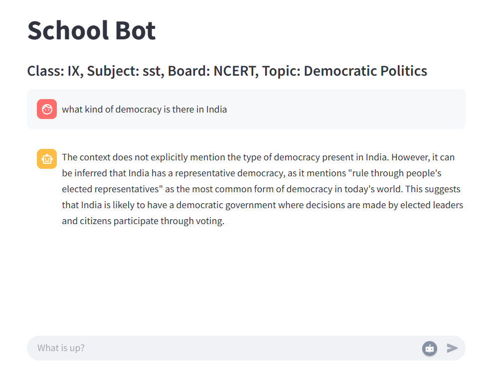

# Teaching Chatbot 
## Detailed blog post
[Question Answer Chatbot using RAG, Llama and Qdrant](https://ranjankumar.in/question-answer-chatbot-using-rag-llama-qdrant-streamlit/)
## Using RAG, Llama Model, Qdrant(Vector DB), Langchain and Streamlit

## Command for data ingestion
`python data_ingestion.py`

## Command for running the app
`streamlit run app.py`

## Prerequisites:
1. `Pdf`files of the the books should be downloaded in `ix-sst-ncert-democratic-politics`.  <strong>Note:</strong> To generalise the chatbot, more book's pdf can be downoaded and ingestion code should be rerun.
2. Qdrant should be running on `http://localhost:6333`
3. Ollama with running Llama model
4. `pip install qdrant-client`
5. `pip install streamlit`
6. `pip install langchain-community`
7. `pip install langchain-ollama`

