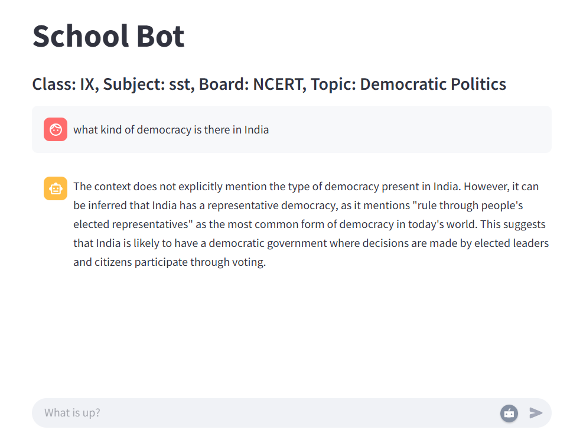

# Teaching Chatbot 
## Detailed blog post
[Question Answer Chatbot using RAG, Llama and Qdrant](https://ranjankumar.in/question-answer-chatbot-using-rag-llama-qdrant-streamlit/)
## Using RAG, Llama Model, Qdrant(Vector DB), Langchain and Streamlit

## Command for data ingestion
`python data_ingestion.py`

## Command for running the app
`streamlit run app.py`

## Prerequisites:
1. `Pdf`files of the the books should be downloaded in `ix-sst-ncert-democratic-politics`.  <strong>Note:</strong> To generalise the chatbot, more book's pdf can be downoaded and ingestion code should be rerun.
2. Qdrant running on `http://localhost:6333`, for example `docker run -p 6333:6333 qdrant/qdrant`
3. Ollama running, with the model pulled: `ollama pull llama3.2`
4. `python -m pip install -r requirements.txt` (tested with Python 3.13 on Windows)

If you ingested with the 2025 version of this repo, `data_ingestion.py` deletes that old collection and rebuilds it, because the old code stored vectors in a layout the current qdrant-client cannot write to.
